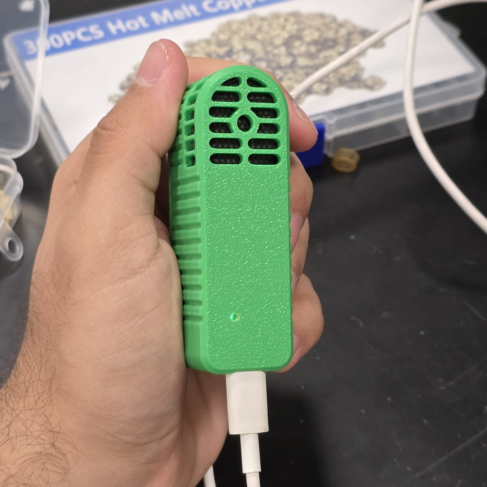
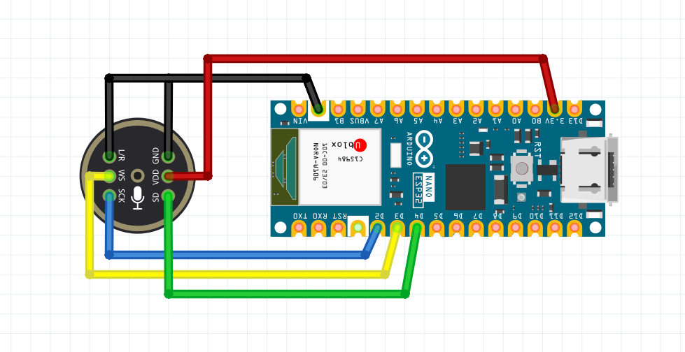
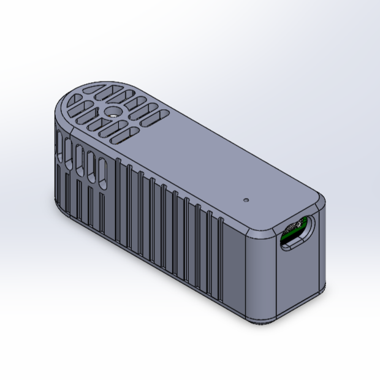
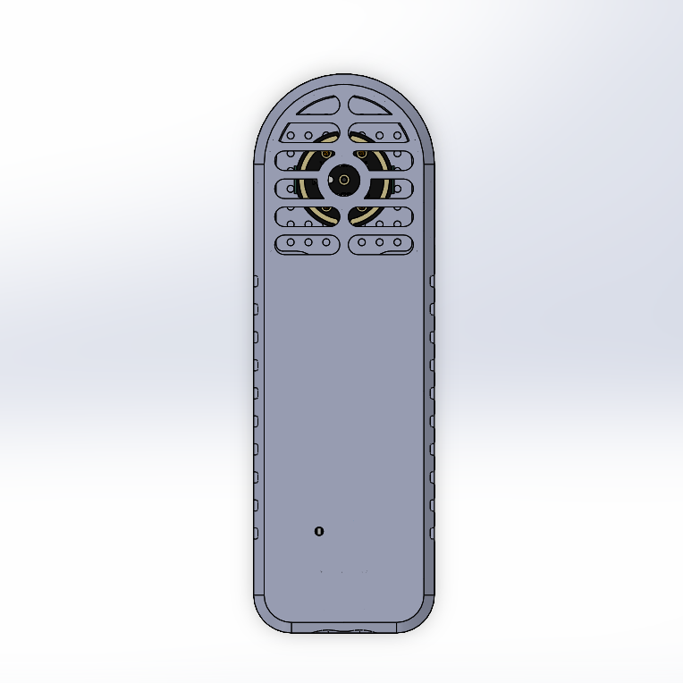
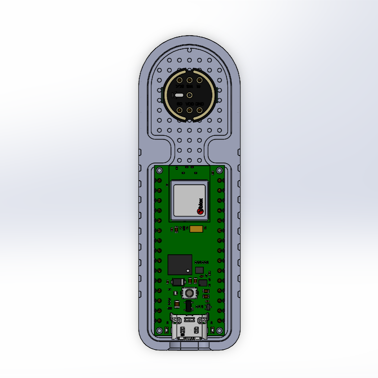
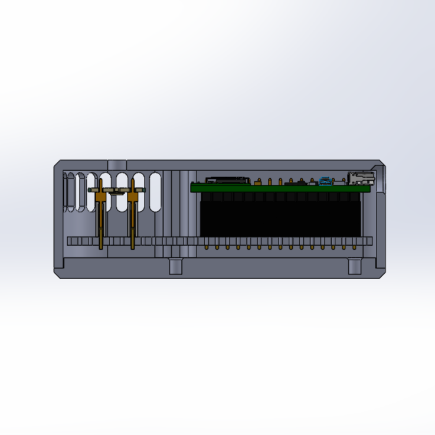

# ESP32-S3 Biometric Voice Key with TinyML & USB-HID

Sistema embebido de autenticación biométrica por reconocimiento de voz basado en **Edge AI / TinyML** ejecutándose de forma autónoma sobre un microcontrolador **ESP32-S3** con micrófono digital I2S **INMP441** y emulación nativa de teclado **USB-HID**.

<p align="center">
  
</p>

---

## Características Principales

- **Detección Automática de Voz (VAD):** Monitoreo acústico continuo en tiempo real con umbral de amplitud y filtro de persistencia temporal para evitar falsos positivos.
- **Pre-Roll Ring Buffer (150 ms):** Búfer circular en memoria RAM para capturar el fonema inicial completo de la palabra clave sin recortes.
- **Cadena DSP Embebida de Alta Eficiencia:**
  - Normalización por valor pico al 95%.
  - Filtro FIR de Pre-énfasis ($y[n] = x[n] - 0.97 \cdot x[n-1]$).
  - Enmarcado con Ventana Hamming (tramas de 30 ms, 15 ms de salto).
  - **FFT Radix-2** optimizada en $O(N \log N)$ (512 puntos en ~0.15 ms).
  - Banco de 40 Filtros Mel triangulares (80 Hz – 7600 Hz).
  - Transformada Discreta del Coseno (DCT-II ortogonal) para 40 coeficientes MFCC.
  - Normalización de Media y Varianza Cepstral (CMVN).
- **Red Neuronal Convolucional (CNN) INT8:**
  - Arquitectura profunda compacta (< 11k parámetros).
  - Cuantización Post-Entrenamiento (PTQ) completa a INT8 en **TensorFlow Lite Micro**.
  - Precisión de validación > 97%.
- **Arquitectura de Software Robusta (FSM No Bloqueante):**
  - Máquina de Estados Finitos (`LISTENING` -> `RECORDING` -> `INFERENCE` -> `AUTH` -> `COOLDOWN`).
  - Purga activa de buffers DMA I2S (`i2s_zero_dma_buffer`) para evitar desincronizaciones o bloqueos tras autenticación.
  - Control de flujo en inyección USB-HID con retardo inter-carácter y liberación forzada (`releaseAll`).
- **Seguridad Criptográfica Ligada al Silicio:**
  - Derivación determinista SHA-256 (KDF) ligada a los eFuses físicos del ESP32-S3 (`esp_read_mac`).
  - La contraseña maestra es fija, única e imposible de replicar en otra placa física.
  - Higiene de memoria con sanitización instantánea (`memset(..., 0, ...)`) de buffers sensibles tras inyección.
- **Retroalimentación Visual con LED RGB Integrado:**
  - **LED Azul:** Modo de escucha continuo (Listo).
  - **LED Rojo:** Grabando palabra clave ("FORWARD").
  - **LED Blanco:** Procesando inferencia TinyML en tiempo real.
  - **LED Verde:** Autenticación exitosa (Token inyectado).
  - **LED Rojo Parpadeante:** Acceso denegado (No coincide la voz).

---

## Hardware y Diagrama de Conexiones

- **Microcontrolador:** Arduino Nano ESP32 / ESP32-S3 (240 MHz Xtensa LX7, 320 KB SRAM).
- **Micrófono MEMS Digital:** INMP441 (I2S, 16-bit mono, 16 kHz).

### Esquema de Conexión (Fritzing)

<p align="center">
  
</p>

| Pin Micrófono INMP441 | Pin Arduino Nano ESP32 | Función de Hardware |
| :--- | :--- | :--- |
| **VDD** | **3.3V** | Alimentación regulada de bajo ruido |
| **GND** | **GND** | Masa de referencia común |
| **SD (Serial Data)** | **D2 (GPIO 5)** | Flujo de datos PCM hacia memoria DMA |
| **WS (Word Select)** | **D3 (GPIO 6)** | Reloj de sincronización de trama LRCK (16 kHz) |
| **SCK (Serial Clock)** | **D4 (GPIO 7)** | Reloj continuo de bits BCLK |
| **L/R (Left/Right)** | **GND** | Configura el micrófono en canal izquierdo |

---

## Diseño Mecánico y Enclosure CAD

El dispositivo cuenta con una carcasa ergonómica personalizada modelada en CAD y fabricada mediante impresión 3D FDM. Incorpora ranuras acusticamente optimizadas para maximizar la captación omnidireccional del micrófono INMP441, orificio guía para el LED RGB de estado y acceso al puerto USB-C nativo.

<p align="center">
  
  &nbsp; &nbsp;
  
</p>

<p align="center">
  
  &nbsp; &nbsp;
  
</p>

---

## Estructura del Repositorio

```text
├── imgREADME/              # Diagramas de conexión, capturas CAD y foto del dispositivo
│   ├── wiring.png          # Diagrama de cableado Fritzing
│   ├── impresion3D.jpeg    # Fotografía del dispositivo ensamblado
│   ├── cad_isometric.png   # Render isométrico de la carcasa
│   ├── cad_top.png         # Vista superior de ventilación acústica
│   ├── cad_internal.png    # Distribución interna del ESP32 y sensor
│   └── cad_cross_section.png # Corte longitudinal del ensamble
├── src/
│   ├── main.cpp            # Firmware completo ESP32-S3 (I2S, VAD, DSP, TFLite, HID)
│   ├── model_data.h        # Modelo TinyML INT8 cuantizado exportado a C array
│   └── mfcc_tables.h       # Tablas precalculadas de Hamming, Mel Filterbank y DCT
├── dataset/                # Muestras de audio WAV y registros de calibración
├── dataset_processed/      # Conjunto balanceado para entrenamiento TinyML
├── prepare_dataset.py      # Preprocesamiento, normalización y balanceo de datos
├── train_tinyml.py         # Extracción MFCC, entrenamiento CNN y cuantización INT8
├── generate_tables.py      # Generador de coeficientes DSP para C++
├── DOCUMENTACION_TECNICA.md# Documentación técnica exhaustiva del sistema
├── DOCUMENTACION_TECNICA.pdf# Documentación técnica formal en PDF
├── platformio.ini          # Configuración del proyecto PlatformIO
└── README.md
```

---

## Compilación y Despliegue

1. Clonar el repositorio:
   ```bash
   git clone https://github.com/opyntorr/esp32-voice-recognizer.git
   cd esp32-voice-recognizer
   ```
2. Abrir el proyecto en **PlatformIO** (VS Code).
3. Poner el ESP32 en modo DFU (**doble clic en el botón RESET**).
4. Compilar y flashear el firmware (`PlatformIO: Upload`).
5. Abrir el Monitor Serie a **921,600 baudios** o simplemente decir **"FORWARD"** frente al micrófono.
